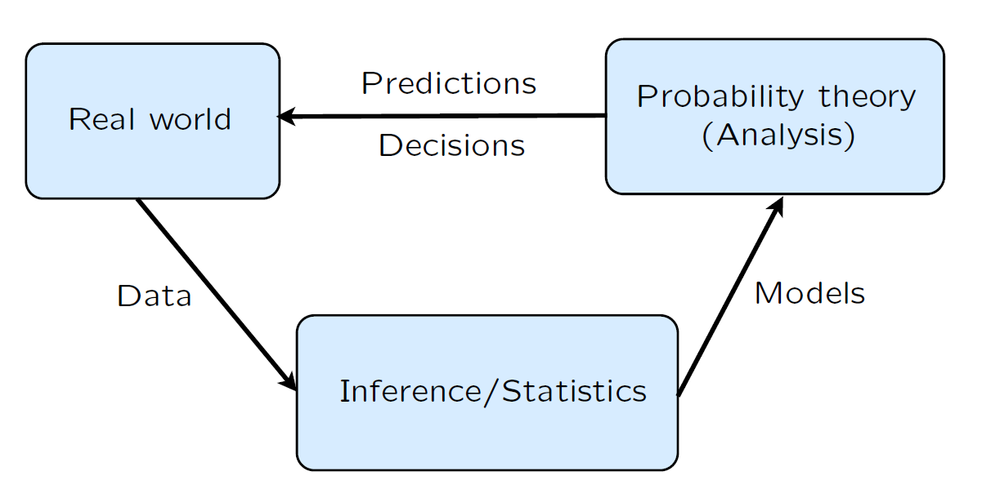

## Probability Models and Axioms

### Sample Space
- Elements of a Sample Space must be mutually exclusive _(no confusion between the outcomes)_ and collectively exhaustive. _(whatever the outcome, we have it in the sample space)_
- Example of a valid Sample Space : S = {Heads and it is raining, Heads and it is not raining, Tails} 
- Example of an invalid Sample Space : S = {Heads and it is raining, Tails and it is not raining, Tails} - if the outcome is “Tails and it is not raining," then the outcome “Tails" will have also occurred. Therefore the elements of  S are not mutually exclusive, and is not a legitimate sample space.  

### Probability Axioms
- Event: a subset of the sample space with a probability (>= 0 and <= 1)

- Axioms:
    - Non-negativity - P(A) >= 0 
    - Normalization - P(S) = 1
    - Finite Additivity _(probability of all disjoint events in S must add upto 1)_

- Consequences of the Axioms:
    - A,B,C disjoint: P(A ∪ B ∪ C) = P(A) + P(B) +P(C)
    - If A ⊂ B, then P(A) ≤ P(B)
    - P(A ∪ B) = P(A) + P(B) − P(A ∩ B)
    - P(A ∪ B) ≤ P(A) + P(B)
    - P(A ∪ B ∪ C) = P(A) + P(A' ∩ B) + P(A' ∩ B' ∩ C)

### Probability Examples
- Discrete Probability
    - Assume Ω consists of n equally likely elements. Assume A consists of k elements.Then : P(A) = k * 1/n
    - Example:     
        - Two rolls of a tetrahedral _(four-faced)_ die 
        - Every possible outcome has a probability 1/16

- Continuous Probability
    - Uniform probability law: Probability = Area
    - Example : (x, y) such that 0 ≤ x, y ≤ 1

### Interpretations of probability theory
- Probabilities as frequencies (Frequentist)
- Probabilities as description of beliefs (Bayesian)

### Role of Probability

### More on Countable Additivity
- Countable Additivity Axiom:
If A1, A2, A3,. . . is an infinite sequence of disjoint events,
then 

    - P(A1 ∪ A2 ∪ A3 ∪ · · ·) = P(A1) + P(A2) + P(A3) +· · ·

- ELI5: The probability of disjoint events is equal to the sum of their individual probabilities